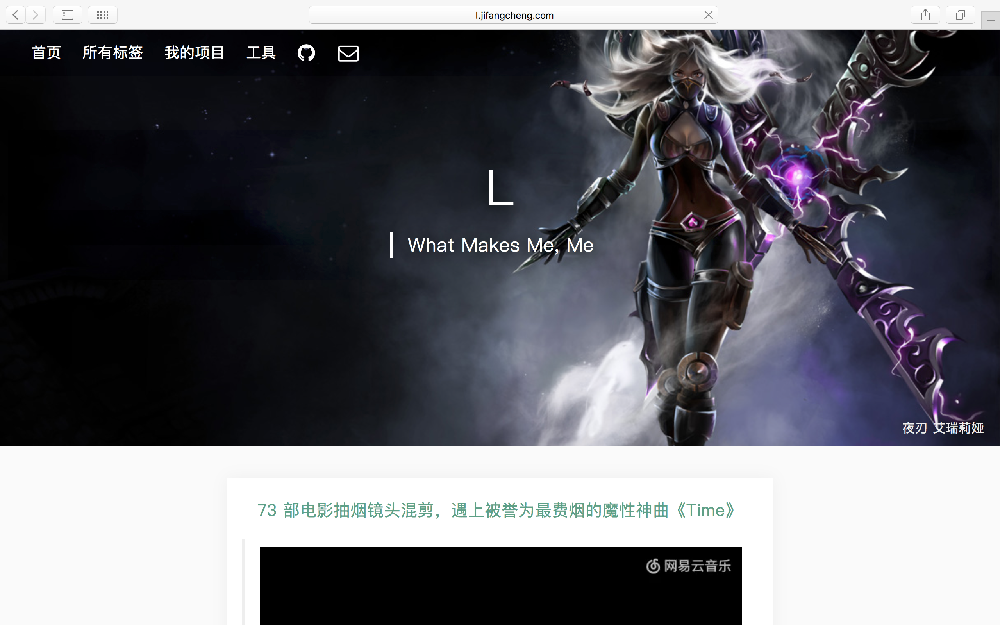
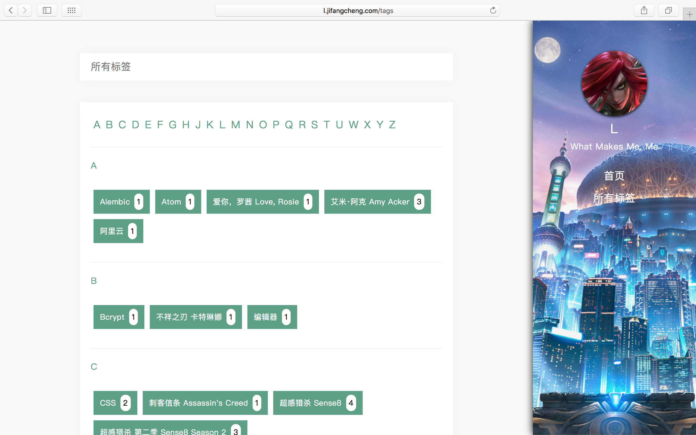
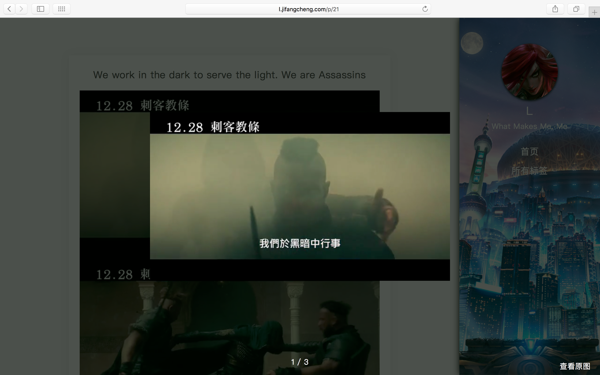

# Diana

Edit | Tags | Article
--- | --- | ---
 |  | 

## Key feature
* Writing with __Markdown__
* Use __label__ to categorize

## Architecture
### frontend
* __npm__
* __webpack__
* __sass__

### backend
* __Flask__ as web framework
* __PostgreSQL__ as database
* __SQLAlchemy__ as ORM

## Quick Start
### frontend
* `npm install` install dependencies
* `npm run dev --Diana:app=blog` start dev environment
* `npm run build --Diana:app=blog` build(for production environment)

### backend

#### play with docker 🐳
* `fab migrate` database migration
* `fab init` Initialize a user(admin/admin) and an article
* `fab runserver`

have fun [http://0.0.0.0:8004](http://0.0.0.0:8004)
